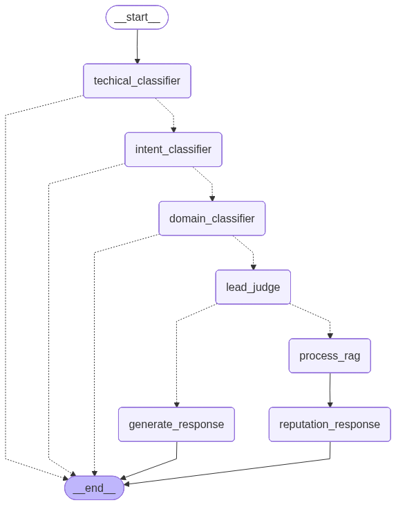

# Discord Response Generator

An LLM-powered pipeline that automatically generates contextual replies to Discord posts. Built with LangGraph, it routes each message through a multi-stage classification flow before deciding whether and how to respond.

## How It Works

Incoming messages first pass through a **regex-based pre-filter** that strips noise and spam before any LLM call is made.

Clean messages then enter a LangGraph state machine:

```
START
  └─ technical_classifier      # Is the post worth processing?
       └─ intent_classifier    # What does the user want?
            └─ domain_classifier  # Is it in our domain?
                 └─ lead_judge    # Is this a sales/lead opportunity?
                      ├─ generate_response   # Direct LLM reply
                      └─ process_rag ──► reputation_response  # RAG-augmented reply
```
<p align="center">
  
</p>

Each node can short-circuit to `END`, so irrelevant or out-of-scope messages are dropped early without wasting tokens.

> **Note:** RAG is only available after running the scripts in `loveable_dox/` — this covers Tavily web crawling, embedding generation, and persisting vectors to the vector store.

## Stack

- **LangGraph** — graph-based agent orchestration
- **RAG** — retrieval-augmented generation for knowledge-heavy replies
- Multi-stage classification: technical → intent → domain → lead scoring

## Project Structure

```
app/
  regex_check/
  loveable_dox
  graph/
    state.py
    conditional_edges.py
    nodes/
      technical_classifier/
      intent_classifier/
      domain_classifier/
      lead_judge/
      lead_response/
      process_rag/
      reputation_response/
```

## Running

```bash
python main_ui.py        # Gradio web UI
python main_terminal.py  # terminal mode — set the source .txt file path directly in the script
```

Output files are saved to the project root directory.


## ENV variables
OPENAI_API_KEY=sk-proj....
ANTHROPIC_API_KEY=sk-ant...
TAVILY_API_KEY=tvly-dev...

GPT_MODEL=gpt-4o-mini
ANTHROPIC_MODEL=claude-sonnet-4-5-20250929

// for tracing only
export LANGSMITH_TRACING=true
export LANGSMITH_ENDPOINT=https://api.smith.langchain.com
export LANGSMITH_API_KEY=....
export LANGSMITH_PROJECT=<<project_name>>
